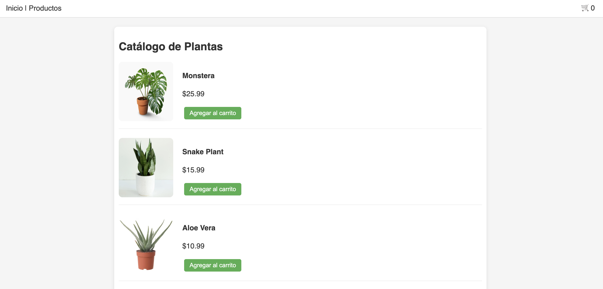

# 🌿 Paradise Nursery

**Paradise Nursery** es una aplicación web desarrollada con **React + TypeScript + Vite** que simula una tienda de plantas de interior. Permite a los usuarios explorar distintas plantas, agregarlas al carrito, ajustar cantidades y ver el total antes de proceder al checkout (simulado).

---

## ✨ Funcionalidades

- Página de bienvenida con acceso al catálogo
- Catálogo con al menos 6 plantas organizadas por categoría
- Carrito de compras dinámico con ícono actualizado
- Ajuste de cantidad de productos desde el carrito
- Eliminación de productos individuales
- Cálculo automático del total de la compra

---

## 🧱 Tecnologías utilizadas

- [React](https://reactjs.org/)
- [TypeScript](https://www.typescriptlang.org/)
- [Vite](https://vitejs.dev/)
- [React Router DOM](https://reactrouter.com/)
- [CSS básico](https://developer.mozilla.org/es/docs/Web/CSS)

---

## 🚀 Instalación y uso local

1. Clona este repositorio:
   ```bash
   git clone https://github.com/tu-usuario/paradise-nursery.git
   ```


